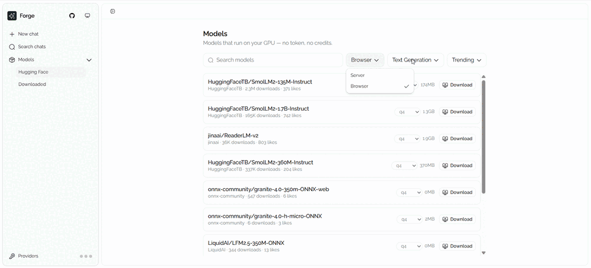

<h1 align="center">Forge</h1>
<p align="center"><b>Test open models without the setup.</b></p>
<p align="center">
  <a href="https://modelplayground.dev">Try it</a> ·
  <a href="#quickstart">Quickstart</a> ·
  <a href="#how-its-built">How it's built</a>
</p>

---

Forge runs Hugging Face models on your GPU, in the browser. No install, no account. Local models
need no API key at all.

<p align="center">
  
</p>

1. Search Hugging Face from inside Forge and pick a model.
2. The weights download to your browser and compile on your GPU.
3. Test it in a playground generated for that model's task. Text models open in chat instead.

The images and audio you test with never leave your browser. A capable chat model is usually too
large for one, so those can also run through the Hugging Face router on your own token.

## Quickstart

```bash
pnpm install && pnpm dev
```

Needs Node 22.13+ and pnpm 11. Local models need WebGPU: Chrome or Edge 113+, Firefox, or Safari 26.

## Features

- 22 task types: transcription, classification, object detection, segmentation, translation,
  summarization, and more.
- A generated UI for every task except chat, compiled in-browser and sandboxed. You can read the
  source.
- Cold-load time, tokens/sec, and per-run latency, measured on your hardware.
- Whichever of q4, q4f16, fp16 and int8 a model ships.
- Any OpenAI-compatible endpoint for chat or codegen, including your own Ollama.

## Keys

Three optional connections, each stored in an httpOnly cookie:

| Connection         | Used for                          |
| ------------------ | --------------------------------- |
| Hugging Face token | Cloud chat through the HF router  |
| Chat provider      | Any OpenAI-compatible endpoint    |
| Codegen provider   | The model that writes playgrounds |

No accounts, no database, and nothing you type is collected. The hosted site counts page views with
Vercel Web Analytics, which is cookieless. A local Ollama works only when you run Forge on your own
machine.

## Deploying

Both variables in `.env.example` are optional and off by default. `/api/codegen` has no
authentication, so rate-limit it at your edge before turning on free codegen publicly.

## How it's built

- One worker holds a single warm model (`lib/browser-model.worker.ts`). `lib/worker-client.ts` is
  the request protocol.
- Local inference implements the AI SDK's `ChatTransport` (`lib/browser-transport.ts`), so nothing
  downstream knows where tokens came from.
- Playgrounds are generated TSX, compiled with esbuild-wasm and run in a sandboxed iframe
  (`lib/playground/`).
- State is zustand stores in `hooks/`. Chats and the model catalog persist to localStorage.

## Feedback

Found a bug or have a request? [Open an issue](https://github.com/AminMusah/forge/issues).

## License

[MIT](LICENSE)
